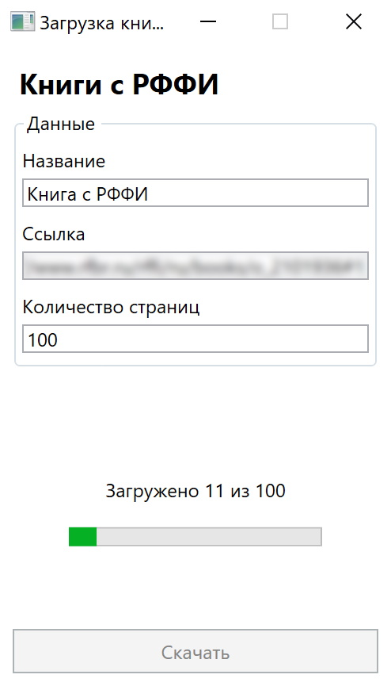

# Скачивание книг с РФФИ

Программа для загрузки книг с [РФФИ](https://www.rfbr.ru).

## Установка

Утилита не требует установки. Скачайте последнюю версию, распакуйте и запустите rfbr-downloader.exe

## TODO

- [ ] Многопоточная загрузка страниц
- [ ] Удаление временных файлов после загрузчки
- [ ] Выбор папки сохранения
- [ ] Улучшение обработки ошибок
- [ ] Скачивание всех доступных страниц

## Лицензия

Проект распространяется под лицензией [MIT](LICENSE)